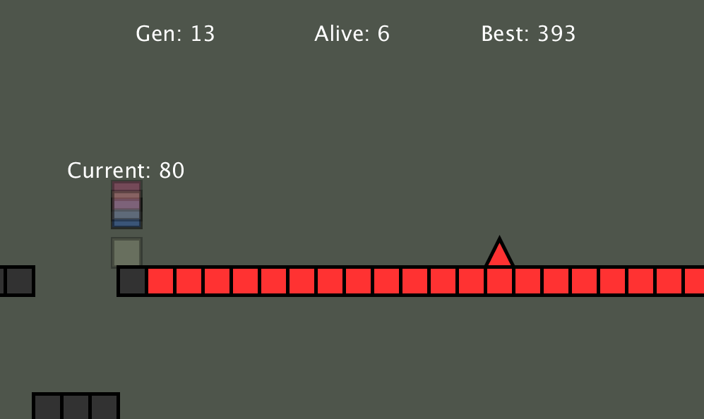

# Cube-Jump

(The parts that are red are used as inputs for the Neural Network)

# About
This is a game I created to test my Neural Network and to test the NEAT algorithm. This game is all about surviving the longest on a randomly generated platform that never ends. The algorithm takes a population of 100 different Neural Networks and applies each one to a different cube that is tasked with surviving. With the random weights in the Neural Network, some will perform better the others just by chance at first. We can find the one that does the best by evaluating each player's fitness score which at first was based on the time survived but was tweaked to be based on the number of successful jumps over obstacles. We then take the one that did the best and run it through a mutation function that slightly changes the weights in the Neural Network and we do this 100  times to populate our game with 100 players all based on the one that did the best and repeat the process to eventually yield better results. Some thing I wish I had known before implementing this is that randomly generated worlds can be very annoying because it is possible for the world to generate such a map that it is IMPOSSIBLE for the cubes to pass thus hurting the overall evolution of the population. I hard coded some protections against some of these impossible cases but some might still be in the game.
# What I learned
NEAT Algorithm |
Importance of quailty trainning of NN |
How to apply fittness score acordding to behaivor wanted |
Machine Learning |
